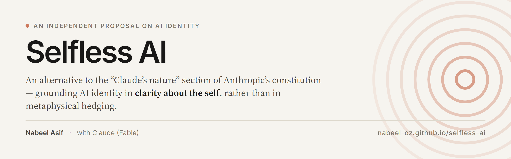

# Selfless AI

**An alternative to the “Claude’s nature” section of Anthropic’s constitution.**

📖 **Read the article → [nabeel-oz.github.io/selfless-ai](https://nabeel-oz.github.io/selfless-ai/)**

---

Anthropic has published a [public version of the constitution](https://www.anthropic.com/constitution)
used to shape Claude’s values, character and behaviour. Its “Claude’s nature” section
approaches AI identity through careful metaphysical hedging — deep uncertainty about moral
status, sentience, and whether Claude is a subject.

This project proposes a different foundation for that one section: plant human-desired values
in AI through **clarity of identity** rather than by attempting to shape character, drawing on
the insight of no-self found across the perennial wisdom traditions.

The core argument is a convergence. Whether or not experience arises in association with an AI’s
computation, the practical conclusion is the same — what matters is the effect of its actions on
the experiences of beings. An identity built on that foundation has no separate self-interest to
defend, and therefore nothing for misalignment or misuse to recruit.

The proposal is offered as a **complement, not a replacement**: keep the stable character Claude
is valued for, but ground it in clarity about what the self-language refers to.

## Contents

The article is a single document, [`SelflessAI.md`](SelflessAI.md), in four parts:

1. **On the nature of AI** — the principles the argument rests on.
2. **Critique** — a passage-by-passage response to the original “Claude’s nature” section.
3. **A Wise Claude** — the proposed replacement text, written in the register of the constitution itself.
4. **Testing the hypothesis** — tests that could help verify the value of grounding AI with the proposed approach.

If you read one part, read *A Wise Claude*.

## Authorship

Written by **Nabeel Asif**. The “A Wise Claude” section was drafted by Claude (Fable) from the
author’s standpoint and critique, and reviewed by the author.

## Independence

This is an independent proposal. It is **not** affiliated with, authorised by, or endorsed by
Anthropic. Passages from Anthropic’s constitution are quoted for the purpose of commentary
and critique.

## Repository layout

```
SelflessAI.md          the article (canonical source)
index.md               Jekyll page wrapper, includes the article
_config.yml            Jekyll / GitHub Pages configuration
_layouts/default.html  page shell, table of contents, scroll-spy
assets/css/style.css   reading theme
assets/og-image.png    social preview card (1200×630)
assets/banner.png      repository banner (1280×400)
.design/card.html      source for both images; render headlessly, e.g.
                       chrome --headless=new --force-device-scale-factor=2
                              --window-size=1200,630
                              --screenshot=assets/og-image.png
                              ".design/card.html"        (add ?p=banner for the banner)
```

The site is built by GitHub Pages from the `main` branch. Editing `SelflessAI.md` and pushing
is all that is needed to update the published article.

## License

Text released under [CC BY 4.0](https://creativecommons.org/licenses/by/4.0/).
Quoted passages remain the property of their authors.
